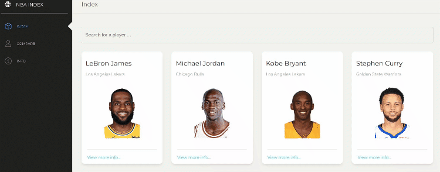
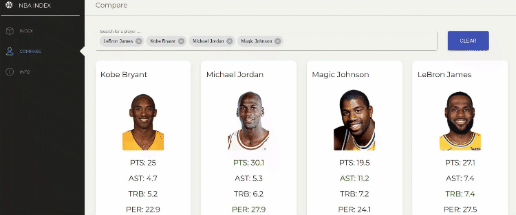

# NBA Index

NBA Index is a web application for NBA fans.  This application allows users to figure out how good players careers are, figure out players market value, determine other similar players and compare players to settle debates.

## Installation/Set Up

Run this command from the root to setup packages.

```bash
yarn setup
```
Run this command from the root to run and compile the backend.

```bash
yarn run:backend
```
Run this command from the root to run and compile web.


```bash
yarn run:web
```

## Main Functionality Demo


## Compare Players Demo



## Tech Stack
* Python
* Tensorflow
* GraphQL
* React
* Redux
* Node.js (14.4.0)
* MongoDB (Cloud Atlas)


## Contributing
Pull requests are welcome. For major changes, please open an issue first to discuss what you would like to change.
